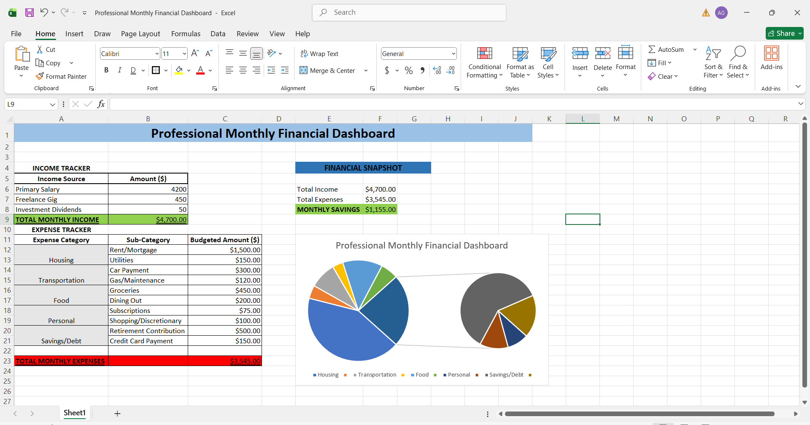
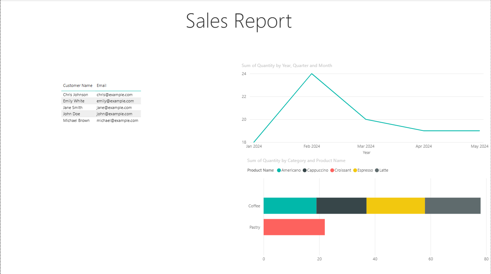
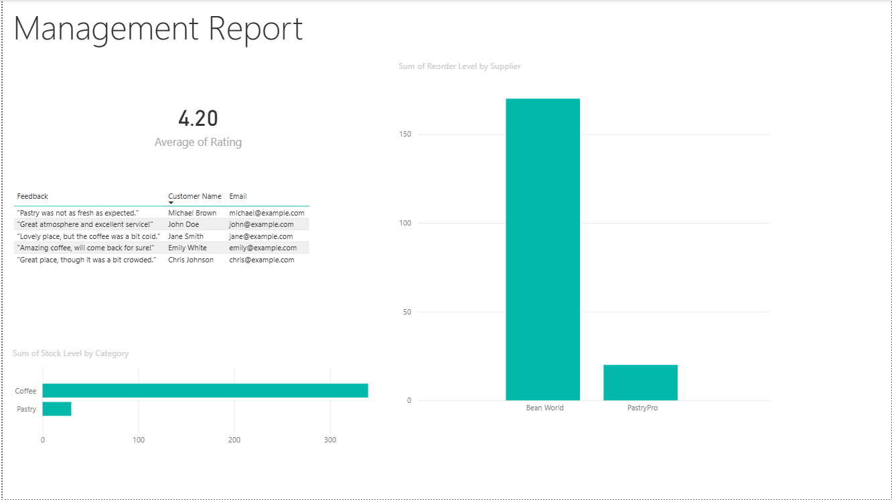

 # Data Analytics Projects

Hands-on data analytics and visualization projects using **Excel**, **Power BI**, **PowerPoint**, and **Canva**.  
Curated and built by **Aditya Kumar Gupta** — MBA (Marketing) | Aspiring Data Analyst  

---

## Featured Project: Professional Monthly Financial Dashboard

### Overview
A financial tracking dashboard created in **Microsoft Excel** to monitor and analyze monthly income, expenses, and savings using charts and formulas.

### Features
- Income and expense tracking  
- Budget vs. actual comparison  
- Automatic calculation of monthly savings  
- Pie chart visualization of expense categories  

### Skills Demonstrated
- Excel Formulas  
- Data Visualization  
- Charting & Formatting  
- Financial Analysis  

---

### Project Preview

---

### Files in This Repository
- `Professional Monthly Financial Dashboard.xlsx` – Excel dashboard project  
- `Dashboard_Preview.png` – Screenshot of the project  
- `README.md` – Project documentation  

---

### Author
**Aditya Kumar Gupta**  
📧 adityaa.guptaa17@gmail.com  
🔗 [LinkedIn](https://www.linkedin.com/in/aditya-kumar-gupta-46ab23159/)  

# ☕ Brew Heaven Power BI Dashboard

### 📖 Overview
Developed an interactive Power BI dashboard for **Brew Heaven**, a local coffee shop chain, to consolidate sales, inventory, and customer feedback data.  
The dashboard provides insights into:
- Sales trends and product performance  
- Customer satisfaction and feedback  
- Stock levels and reorder management

---

### 🧰 Features
- Created two interactive report pages: **Sales Page** and **Management Page**
- Visualized **sales by category, time, and product**
- Integrated **customer feedback** and calculated **average ratings**
- Used **Power Query** for data transformation and cleaning

---

### 💡 Skills Demonstrated
- Power BI  
- Data Cleaning & Modeling  
- Data Visualization  
- DAX Calculations  
- Business Insights & Reporting

---

### 🖼️ Project Preview
#### Sales Page  

#### Management Page  

---

### 📁 Files Included
- `final.pbix` → Power BI project file  
- `Professional_Monthly_Financial_Dashboard.xlsx` → Excel dataset used  
- `README.md` → Project documentation  

---

### 👤 Author
**Aditya Kumar Gupta**  
📧 [aditya.gupta17@gmail.com](mailto:aditya.gupta17@gmail.com)  
🔗 [LinkedIn Profile](https://www.linkedin.com/in/aditya-kumar-gupta-46ab23159)

---

### 🎨 How To Visualize Your Data Using Microsoft PowerPoint

**Overview**  
A hands-on guided project from Coursera focused on creating interactive and engaging PowerPoint presentations for data storytelling and visualization.

**Features**  
- Customized slides with data-driven visuals using SmartArt and charts  
- Enhanced storytelling by combining visuals, transitions, and animations  
- Hands-on practice designing professional presentation layouts  

**Skills Demonstrated**  
- Data Visualization  
- Storytelling with Data  
- Microsoft PowerPoint  
- Presentation Design  

**Project Files**  
- `Project Presentation for Learners 1.odp` – Editable PowerPoint version  
- `Project Presentation for Learners 1.pdf` – Read-only presentation version  

**Credential**  
[View Certificate on Coursera](https://coursera.org/share/6a19eef91fd70cd4c6c44b9eb04c0059)

